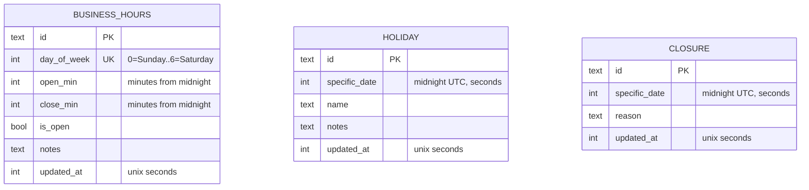

# business_calendar — Database Schema

Three tables, all single-tenant (no `tenant_id` — see `ARCHITECTURE.md` §2).

Notes:

- `business_hours.day_of_week` is UNIQUE — the module never writes more than
  seven rows. `open_min`/`close_min` are minutes from midnight (`0..1439`);
  a closed day normalizes them to `0`.
- `holiday.specific_date` and `closure.specific_date` are unique **by
  convention enforced in the service** (`ErrDuplicateDate`) — there is no DB
  unique constraint on them, so the duplicate guard lives in `AddHoliday` /
  `AddClosure`.
- `Holiday` and `Closure` are separate tables because their **origin** is
  domain-meaningful (`ClosedReason`), not a magic `type` string.
