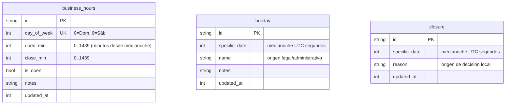

# Base de Datos `business_calendar`

```mermaid
erDiagram
    business_hours {
        string id PK
        int day_of_week UK "0=Dom..6=Sáb"
        int open_min "0..1439 (minutos desde medianoche)"
        int close_min "0..1439"
        bool is_open
        string notes
        int updated_at
    }
    holiday {
        string id PK
        int specific_date "medianoche UTC segundos"
        string name "origen legal/administrativo"
        string notes
        int updated_at
    }
    closure {
        string id PK
        int specific_date "medianoche UTC segundos"
        string reason "origen de decisión local"
        int updated_at
    }
```
